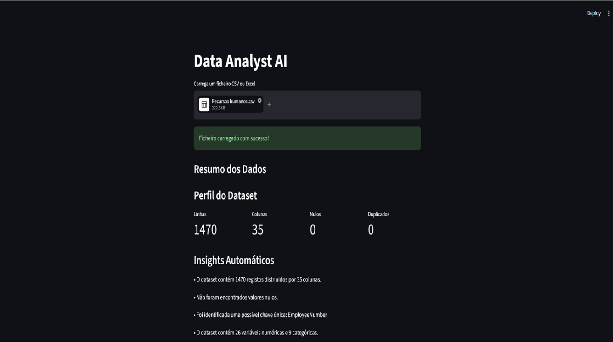
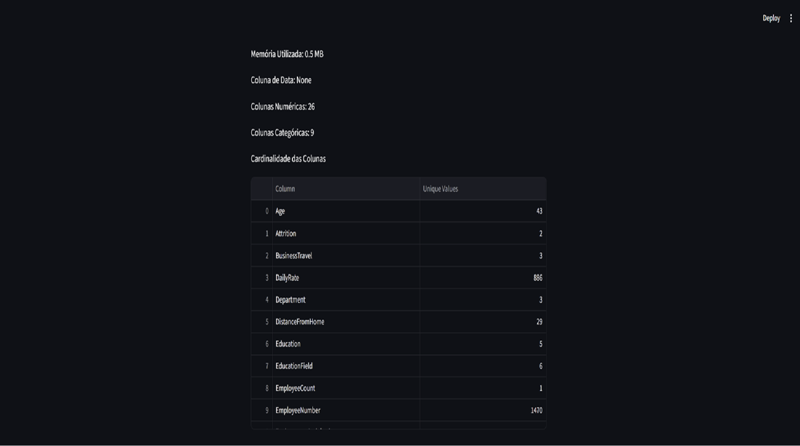
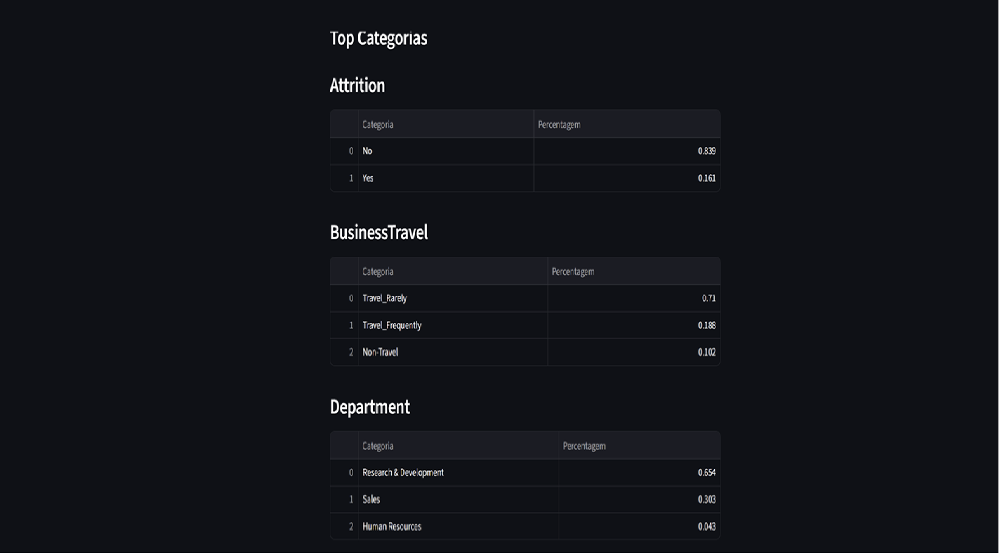
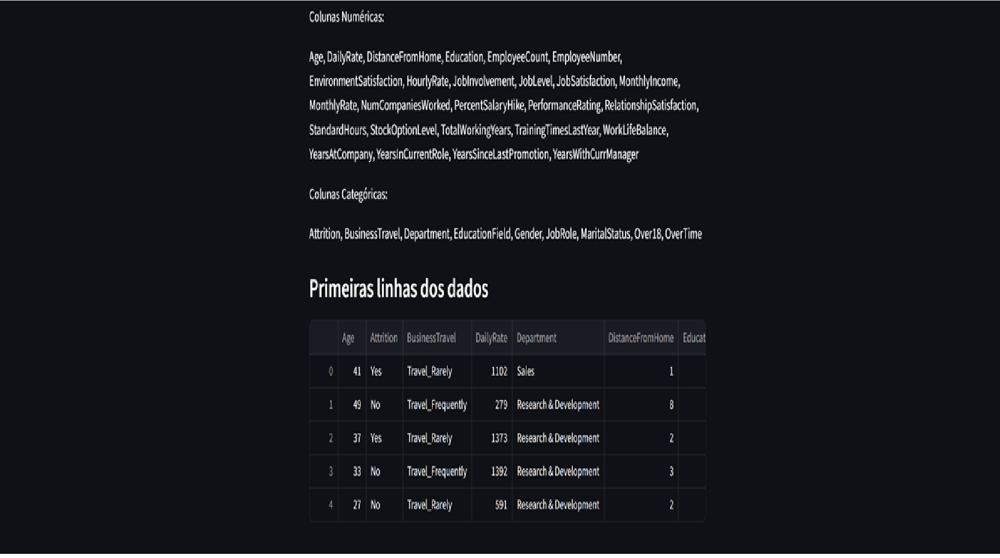
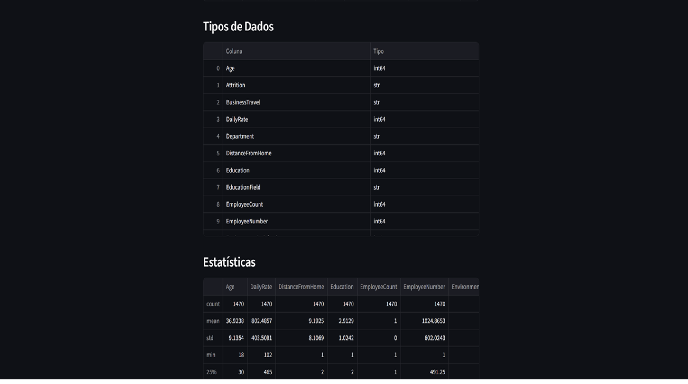
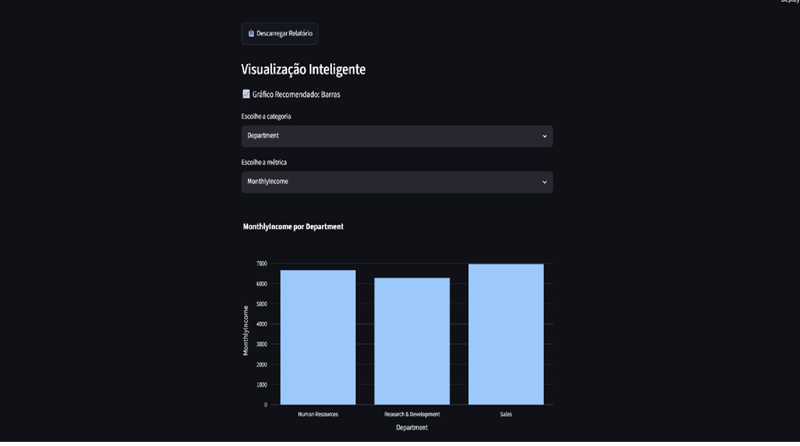

# InsightFlow

InsightFlow is a Business Intelligence application for business owners and managers. It transforms CSV and Excel data into deterministic business metrics, retail insights, executive priorities and practical actions, with an AI assistant that explains the available Business Knowledge.

Built with:

* Python
* Streamlit
* Pandas
* Plotly
* OpenPyXL

---

# Project Overview

The objective is to turn uploaded business data into a reliable decision flow:
deterministic BI first, Business Knowledge second, and AI explanations last.

Users can upload CSV or Excel files and instantly receive:

* Dataset profiling and data quality analysis
* Business Health and deterministic metrics
* Retail/Sales insights and Advanced Retail Intelligence
* Executive priorities and action plans
* Visualization recommendations
* A provider-independent AI Assistant using the available Business Knowledge

---

# Application Preview

## Dataset Upload & Profiling



The application loads CSV and Excel files and automatically generates a complete dataset profile.

---

## Dataset Structure Analysis



The profiler identifies:

* Missing values
* Duplicate records
* Cardinality
* Numerical variables
* Categorical variables
* Potential unique identifiers

## Business Decision Flow

For supported Retail/Sales datasets, InsightFlow builds the decision layer in a
fixed order:

1. Business diagnosis and data quality
2. Business Health and deterministic metrics
3. Business Insights and Advanced Retail Intelligence
4. Executive Priorities and Action Plan
5. AI explanations grounded in the generated Business Knowledge

---

## Category Analysis



Automatic category distribution analysis helps users quickly understand the composition of the dataset.

---

## Data Preview



The application displays the dataset structure and provides an initial overview of the data.

---

## Data Types & Statistics



Automatic generation of:

* Data types
* Descriptive statistics
* Numerical summaries

---

## Intelligent Visualization



The application recommends visualizations based on the dataset structure and allows dynamic selection of categories and metrics.

---

# Features

## Data Upload

* CSV support
* Excel (.xlsx) support

## Dataset Profiling

* Row count
* Column count
* Missing values
* Missing value percentage
* Duplicate detection
* Memory usage
* Cardinality analysis
* Top categories
* Potential primary keys

## Automatic Insights

The application automatically generates insights about:

* Dataset size
* Data quality
* Variable distribution
* Potential unique identifiers

## Intelligent Visualization

Supported charts:

* Line Charts
* Bar Charts
* Histograms

Chart recommendations are generated automatically according to the uploaded dataset.

## AI Assistant

InsightFlow currently represents the product plan through the
`INSIGHTFLOW_PLAN` environment variable. It defaults safely to `free`.

The Free experience keeps deterministic BI, Business Knowledge and the
MockProvider available without an API key. The Free flow is therefore
functional offline and does not depend on a real AI provider.

For Pro usage, set `INSIGHTFLOW_PLAN=pro`, choose a provider with
`INSIGHTFLOW_AI_PROVIDER` and configure the matching API key. The current
provider adapters are `openai`, `anthropic` and `gemini`; `mock` remains
available for deterministic testing. Real providers are only selected by the
application in Pro mode.

Available provider adapters are `mock`, `openai`, `anthropic` and `gemini`.
Anthropic uses `ANTHROPIC_API_KEY` and Gemini uses `GEMINI_API_KEY`. Optional
model overrides are available through `OPENAI_MODEL`, `ANTHROPIC_MODEL` and
`GEMINI_MODEL`. API keys are read only from environment variables.

Free usage limits are optional and disabled by default. They can be enabled
per session with `INSIGHTFLOW_FREE_DATASET_LIMIT` and
`INSIGHTFLOW_FREE_AI_QUESTION_LIMIT`. When a limit is reached, the existing
deterministic analysis remains intact and the interface presents a Pro
discovery point. Authentication, billing and payments are intentionally out of
scope for this stage.

Run the provider tests without making real API calls:

```bash
python -m unittest discover -s tests -v
```


---

# Technologies

* Python
* Streamlit
* Pandas
* Plotly
* OpenPyXL

---

# Project Structure

```text
insightflow/

|-- app.py
|-- requirements.txt
|-- README.md
|-- .gitignore

|-- Images/

`-- src/
    |-- profiler.py
    |-- business_metrics.py
    |-- business_insights.py
    |-- decision_engine.py
    |-- executive_action_planner.py
    |-- charts.py
    `-- ai/
        |-- context_builder.py
        |-- conversation_manager.py
        `-- providers/
```

---

# Installation

```bash
git clone https://github.com/Duh1995/Data-Analyst-AI.git
```

```bash
pip install -r requirements.txt
```

```bash
streamlit run app.py
```

---

# Roadmap

## Current Baseline

Completed:

* Deterministic profiling, metrics and data quality
* Retail/Sales Business Knowledge
* Business Health, insights, priorities and action plans
* Advanced Retail Intelligence
* MockProvider-based AI Assistant
* Provider-independent AI interfaces

## Next Priorities

Planned improvements should strengthen the existing Retail/Sales workflow:

* More robust business explanations and evidence presentation
* Additional validation around uploaded business datasets
* Controlled integration of real AI providers for Pro usage

---

# Learning Objectives

This project was created to improve practical skills in:

* Data Analytics
* Python Development
* Data Visualization
* Software Architecture
* AI Applications for Analytics

---

# Author

Duarte Silva
